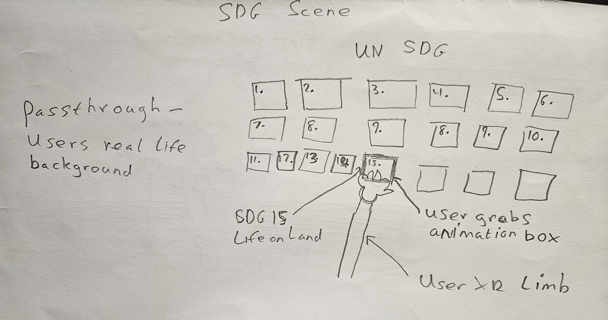
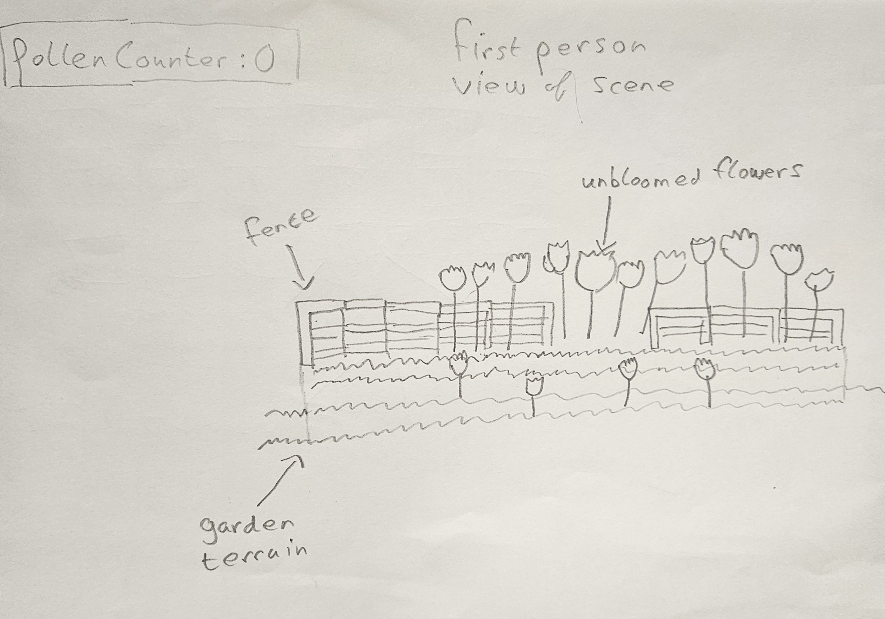
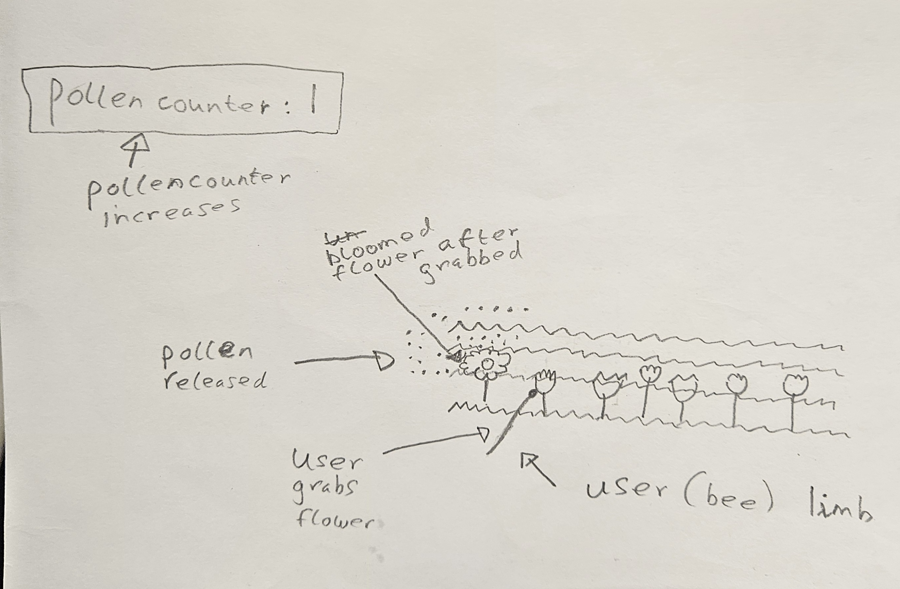
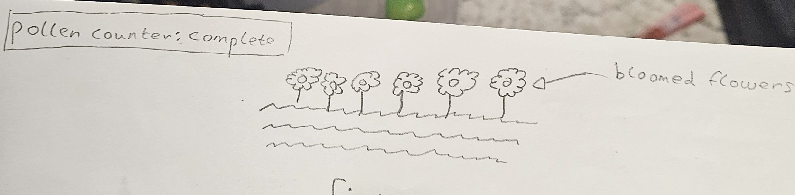
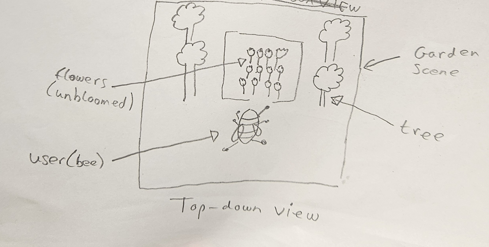

Name: Jason O’Sullivan 

Student number: C22400796 

Class Group: TU856/4

GitHub: https://github.com/JasonOS03

Project Title: PollinatorXR – an XR flower pollinator simulator 

# Video

# Project Proposal 

# Screenshots

# Description of the project

The character of this project represents a bee. This bee floats around an area representing a garden, which spawns a 4x4 grid of flowers. The character can teleport to each flower using a point-and-click teleport mechanic. Once the flower is touched, it blooms and pollen is released into the air (in the form of particles). A pollen counter is maintained, and once all the flowers have bloomed, the goal of pollinating all the flowers will be complete, and victory music will play in the background. The garden contains a stone monument, and this stone monument once pointed at or clicked, will reset the scene to allow for continuous gameplay. The garden also contains a sign, and once clicked will display a fun fact about pollination to the user.

This project was built to demonstrate an interactive scene which aligns with SDG: 15 Life on Land and shows the importance of pollination for the environment and for the flower and crop life cycle. 

# Instructions for use
Step 1:
 Clone the repo
 Open the garden.tscn scene and set it as the main scene in the project settings
Step 2:
 connect the vr headset
Step 3:
Press the remote deploy button in Godot
Step 4:
 Interactions (VR):
 Pick up controller: activate pointer
 Point: Teleport to pointed area
 A/X Button: Teleport to clicked area/ click on sign,flowers or stone monument

# How it works

# List of classes/assets in the project
garden.gd: self-written
flower.gd: self-written
stone_monument.gd: self-written
function_pointer.gd: OpenXR Tools built in script provided when using FunctionPointer node
righthand.gd: self-written
lefthand.gd: self-written
woodensign_2.gd: self-written

Assets:
Garden Mesh: imported 3D model from Free3D.com
Sign Mesh: imported 3D model from Free3D.com
Stone Monument Mesh: Imported form Free3D.com
Bloomed Flower Mesh: Imported from Free3D.com
Unbloomed flower mesh: Imported from sketchfab.com
Tree mesh: imported 3D model from Free3D.com

# References
 Pollination Fun fact: https://www.pollinator.org/pollinator.org/assets/generalFiles/Pollination-Fast-Facts-General-2019.pdf
 The XR action map (no date) Godot Engine documentation. Available at: https://docs.godotengine.org/en/4.4/tutorials/xr/xr_action_map.html (Accessed: 11 December 2025).
 Tween (no date) Godot Engine documentation. Available at: https://docs.godotengine.org/en/stable/classes/class_tween.html (Accessed: 11 December 2025).

# What I am most proud of in this assignment

# What I learned

Project Idea:  

The character of this project represents a bee. This bee floats around an area representing a garden, which grows many flowers. The character can teleport to each flower using a point-and-teleport mechanic. Once the flower is touched, it blooms and pollen is released into the air (in the form of particles). A pollen counter is maintained, and once all the flowers have bloomed, the goal of pollinating all the flowers will be complete, and victory music will play in the background.  

 

Sustainable Development Goal: 

The Sustainable development goal that my project addresses is SDG 15 – Life on Land. The bee itself is a life form, which teleports to these flowers, blooms and pollinates them. The blooming and pollination of the flowers allows them to thrive. It allows users to understand the importance of pollination for a healthy ecosystem. 

 

 

This project is an extension of the Quest:SDG project. The user will grab the Life on Land box, and this will spawn the garden scene. 

This project will be done on an individual basis. 

Key Features and Interactions: 

Teleportation Locomotion: Users will fly to each individual flower using a point and teleport system. This mechanic ensures each flower is easily moved to and accessed.This functionality is provided by the library XR Toolkit. 

Trigger based flower touching: When the user teleports to the flower, they can touch the flower, and it will bloom and release pollen into the environment as a reaction. Implemented through XR Toolkit for the interaction and the hand collisions will be detected by the OpenXR

Particle Effects: Pollen particle effects will appear when the flowers are bloomed, which will provide visual feedback for the user. Implemented using Godot's built in particle system

Pollination counter – A counter will be kept in the top corner of the screen to notify the user of how many flowers have been pollinated. 

XR Technologies: 

Hand Tracking: When the user touches the flower with their virtual bee legs/antennae, the flowers will be pollinated. This feature is provided by the XR Toolkit  

Teleportation Locomotion: Allows the user to seamlessly travel between flowers. 

Spatial Audio: birds chirping, bees buzzing, and calm ambient music will be used to create a relaxing atmosphere. Achieved using Godot's 3D audio system

Passthrough: The user will be able to see the sky as their real life background, making the garden appear as if it existed in their own environment. Passthrough will be implemented through the OpenXR library 

 

Initial QuestSDG main UI scene:

 

 

First Person view of garden scene 

 

 

 

 

 

 

 

 

 

 

 

 

 

 

 

 

 

 

 

Key interactions/ flower grabbing scene 

 

 

 

 

 

 

 

 

 

 

 

 

 

 

 

Spatial Layout/environment 

 

 

 

 
